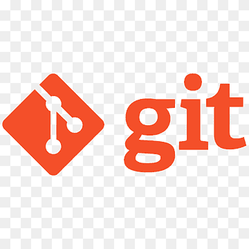

  

# 👋 Hello!

I’m **Juan José Aguado**, soon to graduate (June 2025) as a **Systems & Computer Engineer** with a focus on **Data Engineering**. I’m currently applying AI and social listening methods at Atinna to help organizations understand online conversations.

My interests and areas of expertise include:

* **Data Handling & Pipelines**: Worked on data ingestion and transformation experiments.
* **Machine Learning & AI**: Explored sentiment analysis, trend detection, and NLP models.
* **Cloud & Containerization**: Hands‑on with AWS services and Docker for small-scale deployments.
* **IoT & Real‑Time Concepts**: Built proof‑of‑concept sensor simulations and message routing.
* **Blockchain Fundamentals**: Developed college projects using smart contracts.

I’m passionate about learning new technologies and collaborating on innovative projects that blend engineering and data science.

---

## 🔧 Tools & Technologies

  
  
  
  
  
  
  
  

---

## 📫 Let’s Connect

I’m always open to chat about data, AI, or engineering ideas. Reach out:

<a href="mailto:juanjo.aguado2002@gmail.com">📧 [juanjo.aguado2002@gmail.com](mailto:juanjo.aguado2002@gmail.com)</a>  |  <a href="https://linkedin.com/in/juanjaguado">🔗 LinkedIn</a>
