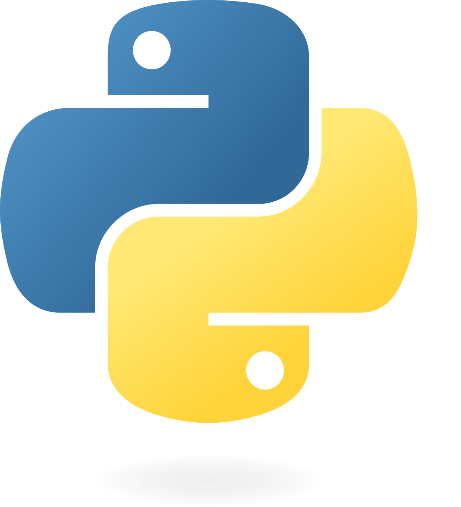
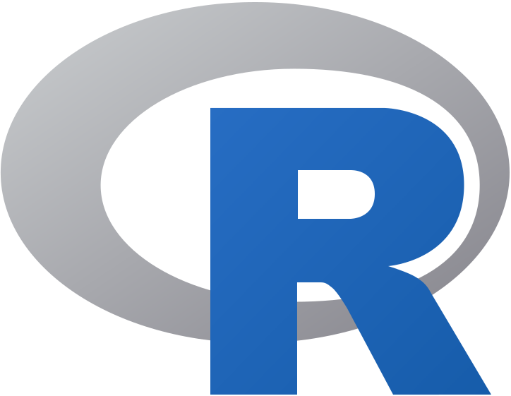
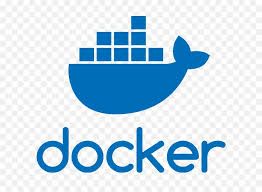
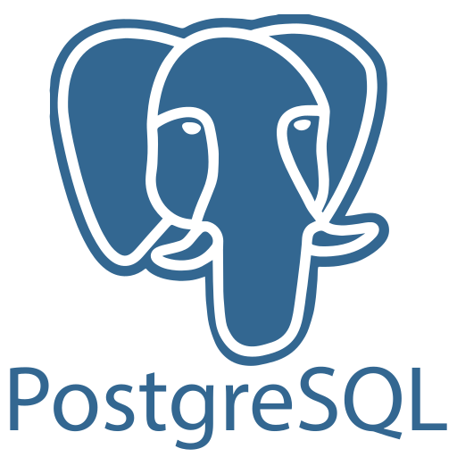
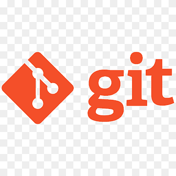
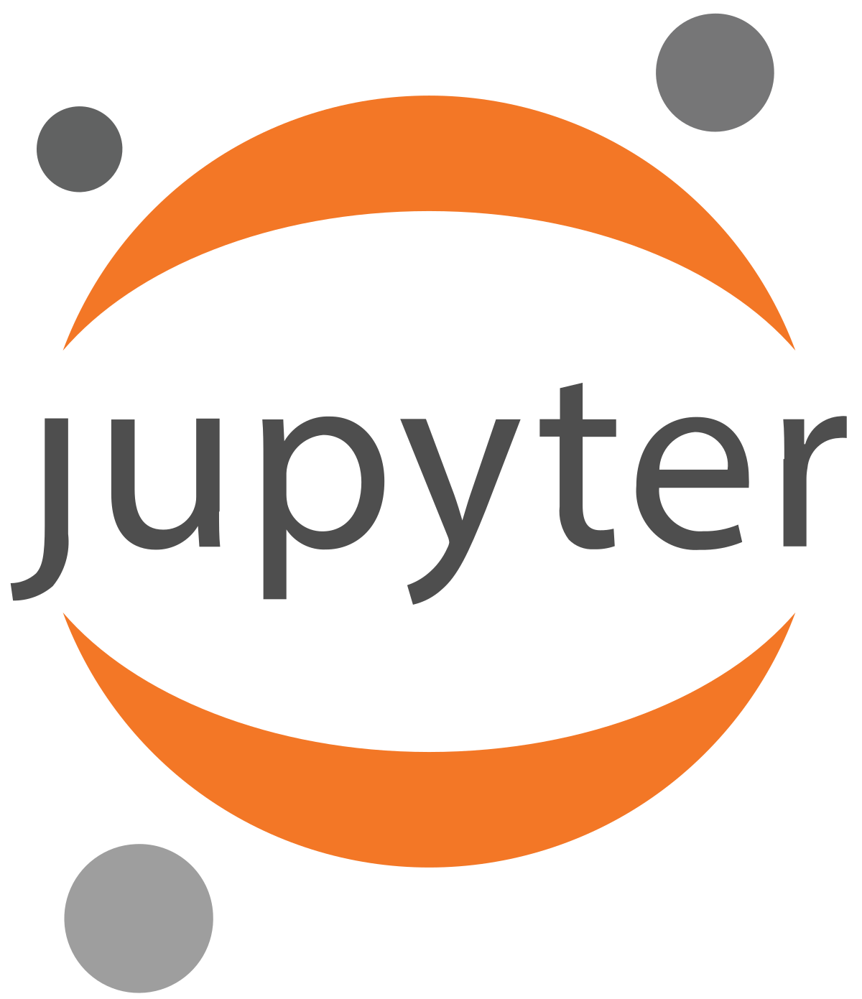

  

# 👋 Hello!

I’m **Juan José Aguado**, a **Systems & Computer Engineer** currently pursuing a **Master’s degree in Applied Artificial Intelligence**. My work focuses on building scalable AI systems, data-driven applications, and production-ready machine learning solutions.

I currently work as an **Artificial Intelligence Engineer at Cadre AI**, where I design and deploy end-to-end AI applications, scalable cloud infrastructure, and intelligent automation systems. Previously, I worked as a **Data Scientist at Atinna**, developing AI-powered analytics and NLP solutions for large-scale social listening and data intelligence projects.

My interests and areas of expertise include:

* **AI Engineering & LLM Applications**: Building production-ready AI systems, RAG pipelines, prompt engineering, and LLM evaluation workflows.
* **Data Engineering & Pipelines**: Designing scalable data pipelines for ingestion, preprocessing, transformation, and deployment.
* **Machine Learning & NLP**: Experience with sentiment analysis, trend detection, embeddings, and intelligent text-processing systems.
* **Cloud & Infrastructure**: Hands-on experience deploying AI workloads with AWS, Azure, Docker, and cloud-native architectures.
* **Analytics & Visualization**: Building telemetry systems, dashboards, and data solutions using Power BI and SQL technologies.
* **Automation & Intelligent Systems**: Developing AI-driven workflows that optimize business operations and reduce manual processes.
* **AI Infrastructure & Observability**: Designed and built full-stack telemetry platforms, monitoring dashboards, and data systems to track AI model performance, system health, and production usage across deployed applications.

I’m passionate about combining engineering, artificial intelligence, and scalable systems to create impactful technology solutions while continuously learning and exploring emerging AI technologies.

---

## 🔧 Tools & Technologies

  
  
  
  
  
  
  
  
  
  
  

---

## 📫 Let’s Connect

I’m always open to discussing AI, data engineering, machine learning, and innovative technology projects.

<a href="mailto:juanjo.aguado2002@gmail.com">📧 juanjo.aguado2002@gmail.com</a>  |  <a href="https://linkedin.com/in/juanjaguado">🔗 LinkedIn</a>
